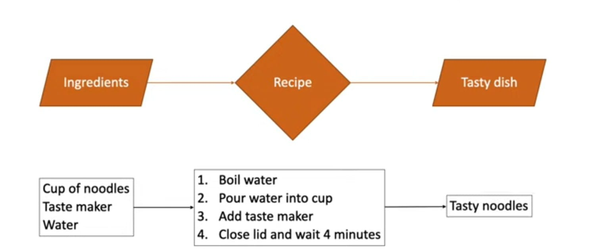
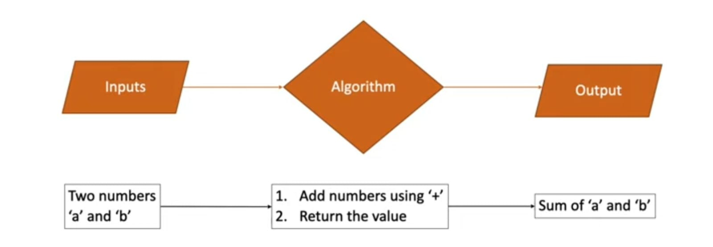

# Algorithms

An algorithm is a set of well defined instructions to solve the problems.

#### Analogy


#### Programming
Algorithm to add two numbers <br/>


#### characteristics
1. Well defined inputs and outputs.
2. Each step should be clear and unambigous.
3. Language independent.

#### Why algorithms?
* As a develover, we're going to come across problems that we need to solve.
* Learning algorithms translates to learning different techniques to efficiently solve those problems.
* One problem can be solved in many ways using different algorithms.
* Every algorithms comes with its own tradeoffs when it comes to performance.

#### Algorithms analysis
There are multiple ways to solve one problem. <br>
  `Example: There are multiple algorithms to sort a list of numbers`
  * How do we analyse which one problem is the most efficient algorithms?<br>
  `Generally, when we talk about performance, we use an absolute measure`<br>
  `If i can run 100 meters in 12 seconds, I'm faster than someone who takes 15 seconds.`<br>

<ins>Condition:</ins><br>
The absolute running time of algorithms cannot be predicted, since it depends on a number of factors
* Programming language used to implement an algorithm.
* The computer the program runs on.
* Other programs running at the same time.
* Quality of the Operating System.

we evaluate the performance of an algorithm in <ins>terms of its input size</ins><br>
**Time complexity** - Amount of time taken by an algorithm to run, as a function of input size.<br>
**Space complexity** - Amount of memory taken by an algorithm to run, as a function of input size.

- By evaluating against the input size, the analysis is not only machine independent but the comparision is also more appropriate.
- There is no one solution that works every single time. It is always good to know multiple ways to solve the problem and use the best solution, given your constraints.
- If your app needs to be very quick and plenty of memory to work with, you don't have to worry about space complexity.

#### How to represent Complexity?
`Asymptotic notations`<br>
* Mathematical tools to represent time and space complexity
1. Big-O Notation (O-notation) - Wrost case Complexity
2. Omega Notation (Ω-notation) - Best case complexity
3. Theta Notation (θ-notation) - Average case complexity

`Big-O Notation`<br>
- The worst case complexity of an algorithm is represented using the Big-O notation.
- Big-O notation describes the complexity of an algorithm using algebric terms.
- It has two important characteristics
1. It is expressed in terms of the input.
2. It focus on the bigger picture without getting caught up in the minute details.

#### Calculations
```javascript
  function summation(n){
    let sum = 0;
    for(let i=1; i<=n>; i++){
      sum += i;
    }
    return sum;
  }
```
`Example:`
```
summation(4) = 10
1 + 2 + 3 + 4 = 10
```
Given n=4 (line-1)
```
function summation(n){ -> n=4
```
execute (line-2)
```
let sum = 0; -> 1 time
```
execute loop
```
    for(let i=1; i<=n>; i++){
      sum += i;  -> 4 times
    }
```
execute return
```
return sum; -> 1 time
```
total count = 1 + 4 + 1 = 6<br>
n = n+2<br>
T(n) = O(n+2) = O(n)

```
n=100            100+2
n=1000          1000+2
n=10000        10000+2
.
.
.
n=10000000  10000000+2
```
`Time Complexity: O(n) - linear(most of the time)`
<hr>

```javascript
  function summation(n){
    return (n * (n + 1)) / 2;
  }
```
`Time Complexity: O(1) - Constant`

<hr>

```javascript
  function summation(n){
    for(let i=1; i<=n; i++){
      for(let j=1; j<=n; j++){
      
      }
    }
  }
```
`Time Complexity: O(n^2) - Quadratic (3n^2 + 5n + 1)`

<hr>

```javascript
  function summation(n){
    for(let i=1; i<=n; i++){
      for(let j=1; j<=n; j++){
        for(let j=1; j<=n; j++){
      
        }
      }
    }
  }
```
`Time Complexity: O(n^3) - Cubic (8n^3 + 3n^2 + 5n + 1)`

<hr>

```javascript
  function summation(n){
    for(let i=1; i<=n; i++){
      n = n/2
    }
  }
```
* input n reduces by half on every iteration

`Time Complexity: O(logn) - Logarithimic`

#### Space Complexity
* O(1) - constant
* O(n) - Linear
* O(logn) - Logarithimic

`Always avoid the Quadratic or more than to making algorithms`

#### Big-O complexity chart


#### Big-O Guide
- Calculation not depend on input size - O(1)
- 1 loop - O(n);
- 2 nested loops - O(n^2)
- Input size reduced by half - O(logn)

#### Few important points
1. Multiple algorithms exist for the same problem and there is no one right solution. Different algorithms work well under different constraints.
2. The same algorithm with the same programming language can be implemented in different ways.
3. When writing programs at work, don't lose sight of the big picture. Rather than writing clever code, write code that is simple to read and maintain.

#### Algorithms design techniques

<ins>**Brute Force**</ins> - Simple and exhaustive techniques that evaluates every possible outcome to find the best solution. <ins>Ex</ins>: Linear search

<ins>**Greedy**</ins> - choose the best option at the current time, without any consideration for the future. <ins>Ex</ins>: Dijkstra's algorithm, Prism's algorithm and kruskal's algorithm.

<ins>**Divide and Conquer**</ins> - Divide the problem into smaller sub-problems. Each sub-problem is then solved and the partial solutions are recombined to determine the overall solution. <ins>Ex</ins>: Binary Search, Quick Sort, Merge Sort and Tower of Hanoi.

<ins>**Dynamic Programming**</ins> - Divide the problem into smaller sub-problems. Break it down into smaller but overlapping sub-problems. Store the result and reuse it for the same sub-problems. This is called memoization and is a optimization technique that improves the time complexity of your algorithm. <ins>Ex</ins>: Fibonacci number and climbing staircase

<ins>**Backtracking**</ins> - Generate all possible solutions. Check if the solution satisfies all the given constrains and only then you proceed with generating subsequent solutions. if the constraints are not satisfied, backtrack and go on a different path to find the solution. <ins>Ex</ins>: N-Queens Problem