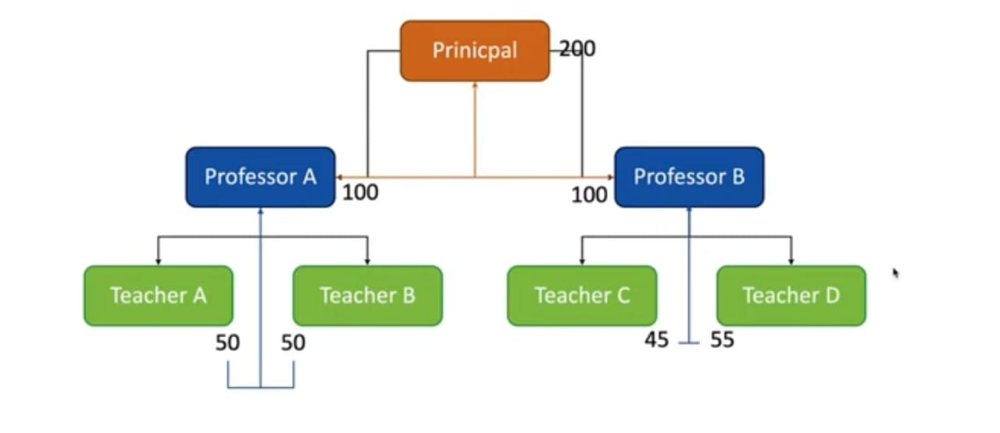

# Recursion

#### What is recursion?
- Recursion is a problem solving technique where the solution depends on solutions to smaller instances of the same problem.
- Recursion is when a function calls itself.

#### Why recursion?
- A great technique to simplify your solution.
- If you find yourself breaking down your problem into smaller versions of the same problem, recursion is very useful.

#### Analogy

#### Few Points about recursion
- Every recursive solution needs to have a base case - a condition to terminate the recursion.
- Recursion might simplify solving a problem but it does not always translate to a faster solution. A recursive solution may be far worse compared to an iterative solution.
- Recursion is a topic that is not the most straight forward to understand. Do not give up if you struggle with the concept.