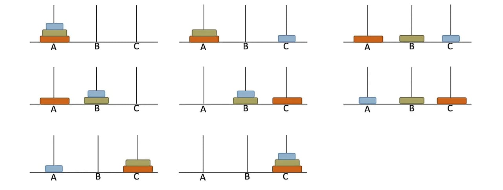

# Tower of Hanoi

<ins>**Objective**</ins>: The Objective of the puzzle is to move the entire staxk to the last rod, obeying the following rules:

- Only one disk may be moved at a time
- Each move consists of taking the upper disk from one of the stacks and placing it on the top of another stack or on an empty rod.
- And lastly, No disk may be placed on the top of a disk that is smaller.

#### Visualization
<br>
Use these 3 steps and repeat again and again to solve the problem.
```
Shift n-1 disks from A to B using C (when required)
shift last disk from A to C
shift n-1 disks from B to C using A (when required)
```

#### Code Solution
```javascript
function towerOfHanoi(n, fromRod, toRod, usingRod) {
    if(n===1){
        console.log(`Move disk 1 from ${fromRod} to ${toRod}`);
        return;
    }
    towerOfHanoi(n-1, fromRod, usingRod, toRod)
    console.log(`Move disk ${n} from ${fromRod} to ${toRod}`);
    towerOfHanoi(n-1, usingRod, toRod, fromRod)
}
towerOfHanoi(3, "A", "C", "B");//7 moves
/*
Move disk 1 from A to C
Move disk 2 from A to B
Move disk 1 from C to B
Move disk 3 from A to C
Move disk 1 from B to A
Move disk 2 from B to C
Move disk 1 from A to C
*/
```

#### Time Complexity 
Here 2 recursive call itself on nth time so the complexity here O(2^n).

```
    function towerOfHanoi(n, fromRod, toRod, usingRod) {
    if(n===1){
        console.log(`Move disk 1 from ${fromRod} to ${toRod}`);
        return;
    }
    towerOfHanoi(n-1, fromRod, usingRod, toRod)
    console.log(`Move disk ${n} from ${fromRod} to ${toRod}`);
    towerOfHanoi(n-1, usingRod, toRod, fromRod)
}
```

`Time complexity` - O(2^n)