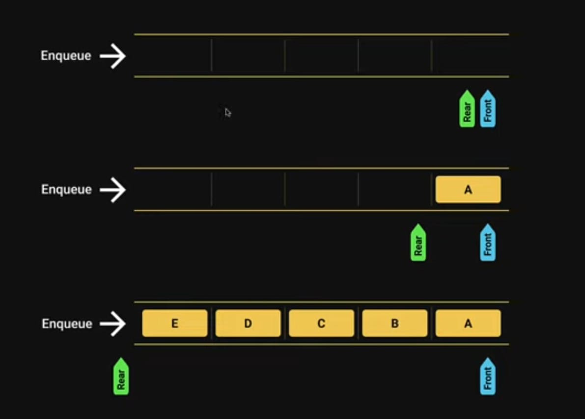
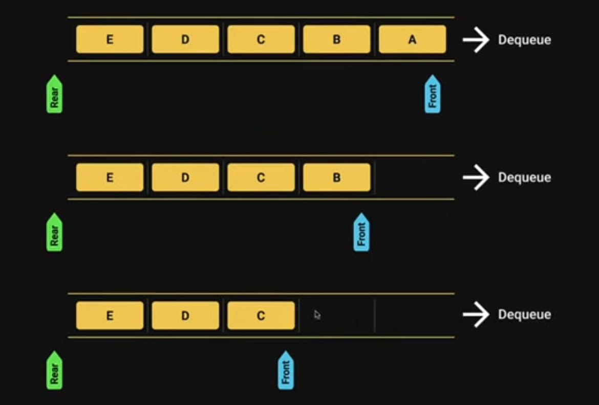
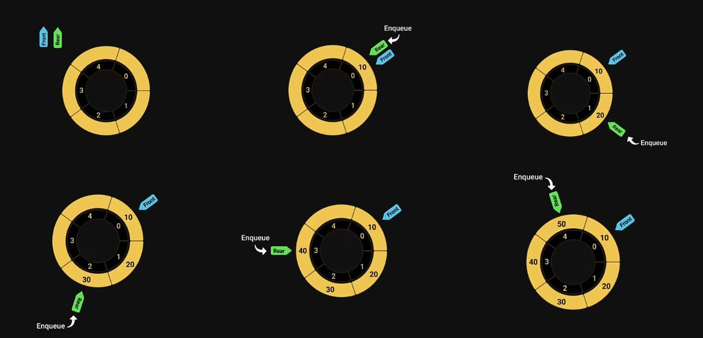
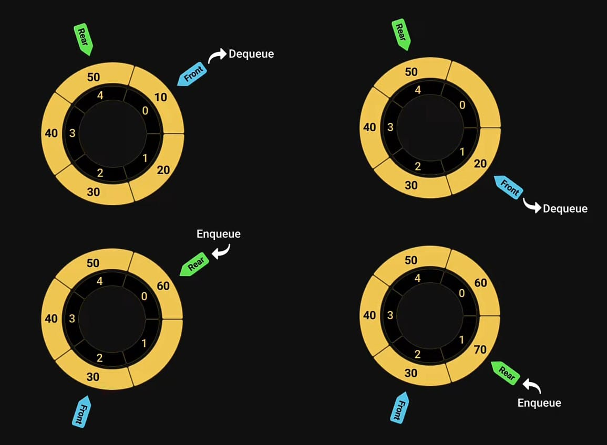

# Queue
- The `queue data structure` is a sequential collection of elements that follows the principle of `First In First Out` (FIFO).
- The `first element inserted` into the queue is `first element to be removed`.
- A queue of people. People enter the queue at one end (rear/tail) and leave the queue from the other end (front/head).
- Queue is an abstract data type. It is defined by its behaviour rather than being a mathematical model.
- The Queue data structure supports two main operations.
    - Enqueue, which adds an element to the rear/tail of the collection.
    - Dequeue, which removes an element from the front/head of the collection.

#### Visualization
- Enqueue<br>

- Dequeue<br>


#### Usage - Example
- Printers
- CPU task scheduling
- Callback queue in Javascript runtime

#### Implementation
- `enqueue(element)` - add an element to the queue.
- `dequeue()` - remove the oldest element from the queue.
- `peek()` - get the value of the element at the front of the queue without removing it.
- `isEmpty()` - check if the queue is empty.
- `size()` - get the number of elements in the queue.
- `print()` - visualize the elements in the queue.

#### Code Example
- Basic structure - This method has not all constant Time complexity (O(1))
```javascript
class Queue{
    constructor(){
        this.items = []
    }
    enqueue(element){
        this.items.push(element);
    }
    dequeue(){
        return this.items.shift();
    }
    isEmpty(){
        return this.items.length === 0;
    }
    peek(){
        if(!this.isEmpty()){
            return this.items[0];
        }
        return null;
    }
    size(){
        return this.items.length;
    }
    print(){
        console.log(this.items.toString());
    }
}
const queue = new Queue()

console.log(queue.isEmpty());//true

queue.enqueue(10)
queue.enqueue(20)
queue.enqueue(30)

console.log(queue.size());//3

queue.print()//10,20,30

console.log(queue.dequeue());//10

queue.print()//20,30

console.log(queue.peek());//20
```

- Optimised structure - Using(two pointer) this method all methods have O(1) Time Complexity
```javascript
class Queue {
  constructor() {
    this.items = [],
    this.rear = 0,
    this.front = 0
  }
  enqueue(element) {
    this.items[this.rear] = element;
    this.rear++;
  }
  dequeue() {
    const item = this.items[this.front];
    delete this.items[this.front];
    this.front++;
    return item;
  }
  isEmpty() {
    return this.front - this.rear === 0;
  }
  peek() {
    return this.items[this.front];
  }
  size() {
    return this.rear - this.front;
  }
  print() {
    console.log(this.items);
  }
}
const queue = new Queue();

console.log(queue.isEmpty()); //true

queue.enqueue(10);
queue.enqueue(20);
queue.enqueue(30);

console.log(queue.size()); //3

queue.print(); //[10,20,30]

console.log(queue.dequeue()); //10

queue.print(); //[ <1 empty item>, 20, 30 ]

console.log(queue.peek()); //20
```

## Circular Queue
- The size of the queue is fixed and a single block of memory is used as if the first element is connected to the last element.
- Also referred to as circular buffer or ring buffer and allows the FIFO principle.
- A circular queue will reuse the empty block created during the dequeue operation
- When working with queues of fixed maximum size, a circular queue is a great implementation choice.
- The Circular Queue data structure supports two main operations.
    - Enqueue, which adds an element to the rear/tail of the collection.
    - Dequeue, which removes an element from the front/head of the collection.

#### Visualization
- Enqueue <br>

- Dequeue <br>


#### Usage - Example
- Clock
- Streaming data
- Traffic lights

#### Implementation
- `enqueue(element)` - add an element to the queue.
- `dequeue()` - remove the oldest element from the queue.
- `isFull()` - check if the queue is full.
- `isEmpty()` - check if the queue is empty.
- `peek()` - get the value of the element at the front of the queue without removing it.
- `size()` - get the number of elements in the queue.
- `print()` - visualize the elements in the queue.

#### Code Solution
- All methods have O(1) Time complexity except print methods.
```javascript
class CircularQueue {
  constructor(capacity) {
    this.items = new Array(capacity);
    this.capacity = capacity;
    this.currentLength = 0;
    this.rear = -1;
    this.front = -1;
  }
  isFull() {
    return this.currentLength === this.capacity;
  }
  isEmpty() {
    return this.currentLength === 0;
  }
  enqueue(element) {
    if (!this.isFull()) {
      this.rear = (this.rear + 1) % this.capacity;
      this.items[this.rear] = element;
      this.currentLength += 1;
      if (this.front === -1) {
        this.front = this.rear;
      }
    }
  }
  dequeue() {
    if (this.isEmpty()) {
      return null;
    }
    const item = this.items[this.front];
    this.items[this.front] = null;
    this.front = (this.front + 1) % this.capacity;
    this.currentLength -= 1;
    if (this.isEmpty()) {
      this.front = -1;
      this.rear = -1;
    }
    return item;
  }
  peek() {
    if (!this.isEmpty()) {
      return this.items[this.front];
    }
    return null;
  }
  print() {
    if (this.isEmpty()) {
      console.log("Queue is Empty");
    } else {
      let i;
      let str = "";
      for (i = this.front; i !== this.rear; i = (i + 1) % this.capacity) {
        str += this.items[i] + " "
      }
      str += this.items[i]
      console.log(str);
    }
  }
}
const queue = new CircularQueue(5)

console.log(queue.isEmpty());//true

queue.enqueue(10)
queue.enqueue(20)
queue.enqueue(30)
queue.enqueue(40)
queue.enqueue(50)

console.log(queue.isFull());//true
queue.print()//10 20 30 40 50

console.log(queue.dequeue());//10
console.log(queue.isFull());//false
queue.print()//20 30 40 50

console.log(queue.peek());//20

queue.enqueue(60)
console.log(queue.isFull());//true
queue.print()//20 30 40 50 60
```