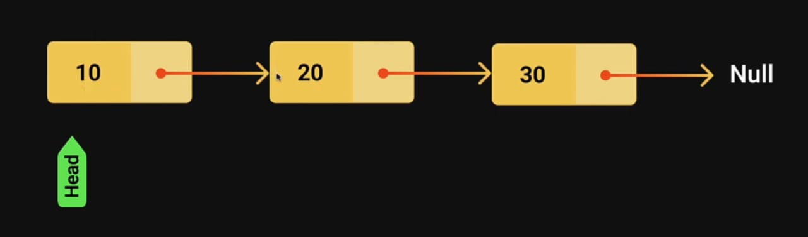

# Linked List
- A linked list is alinear data structure that includes a series of connected nodes.
- Each node consists of a data value and a pointer that points to the next node.
- The list elements can be easily inserted or removed without reallocation or reorganization of the entire structure.
- Random access of elements is not accessing an element has linear time complexity.
- The linked list data structure three main operations
    1. `Insertion` - to add an element at the begining, end or at a given index in the list
    2. `Deletion` - to remove an item given its index or value.
    3. `Search` - to find an element given its value.

#### Visualization


#### Usage - Example
- All applications of both stacks and queues are applications of linked lists.
- Image viewer

#### Code Example
- Node class
```javascript
class Node {
  constructor(value) {
    this.value = value;
    this.next = null;
  }
}
```
- Linked List methods class
```javascript
class LinkedList {
  constructor() {
    this.head = null;
    this.size = 0;
  }
  isEmpty() {
    return this.size === 0;
  }
  getSize() {
    return this.size;
  }
  addFirst(value) {
    //prepend
    const node = new Node(value);
    if (this.isEmpty()) {
      this.head = node;
    } else {
      node.next = this.head;
      this.head = node;
    }
    this.size++;
  }
  addLast(value) {
    //append
    const node = new Node(value);
    if (this.isEmpty()) {
      this.head = node;
    } else {
      let prev = this.head;
      while (prev.next) {
        prev = prev.next;
      }
      prev.next = node;
    }
    this.size++;
  }
  add(value, index = this.size) {
    if (index < 0 || this.size <= index) {
      //invalid index
      return;
    }
    if (index === 0) {
      this.addFirst(value);
    } else {
      const node = new Node(value);
      let prev = this.head;
      for (let i = 0; i < index - 1; i++) {
        prev = prev.next;
      }
      node.next = prev.next;
      prev.next = node;
      this.size++;
    }
  }
  remove(index) {
    if (index < 0 || this.size <= index) {
      //invalid index
      return;
    }
    let removedNode;
    if(index === 0){
        removedNode = this.head
        this.head = this.head.next
    } else {
        let prev = this.head
        for(let i=0; i<index-1; i++){
            prev = prev.next
        }
        removedNode = prev.next
        prev.next = removedNode.next
    }
    this.size--;
    return removedNode.value
  }
  print() {
    if (this.isEmpty()) {
      console.log("List is Empty.");
    } else {
      let curr = this.head;
      let listValues = "";
      let index = 0;
      while (curr) {
        listValues += `${curr.value} -> `;
        index++;
        if (this.getSize() === index) {
          listValues += "null";
        }
        curr = curr.next;
      }
      console.log(listValues);
    }
  }
}
```
- Use of linked list methods
```javascript
const list = new LinkedList();
console.log("List is empty?", list.isEmpty()); //true
console.log("List size:", list.getSize()); //0
list.print(); //List is Empty.

list.addFirst(10);
list.print(); //10 -> null

list.addFirst(20);
list.addFirst(30);
list.print(); //30 -> 20 -> 10 -> null

list.addLast(5);
list.addLast(10);
list.addLast(15);
list.print(); //30 -> 20 -> 10 -> 5 -> 10 -> 15 -> null

list.add(10, 0);
list.print(); //10 -> 30 -> 20 -> 10 -> 5 -> 10 -> 15 -> null

list.add(20, 4);
list.print(); //10 -> 30 -> 20 -> 10 -> 20 -> 5 -> 10 -> 15 -> null

list.add(10);
list.print(); //10 -> 30 -> 20 -> 10 -> 20 -> 5 -> 10 -> 15 -> 10 -> null

console.log(list.getSize())//8
list.remove(5);
list.print()//10 -> 30 -> 20 -> 10 -> 20 -> 10 -> 15 -> null || removed = 5
console.log(list.getSize())//7
```

#### Time Complexity
- `isEmpty()` - O(1)
- `getSize()` - O(1)
- `addFirst()` - O(1)
- `addLast()` - O(n)
- `add()` - O(n) (variable sometime O(1) when index 0)
- `remove()` - O(n)
- `print()` - O(n)