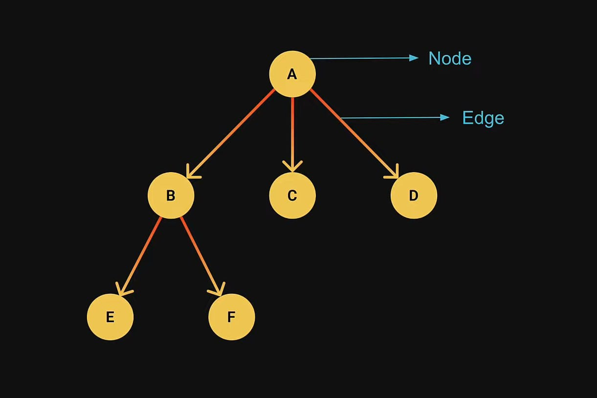
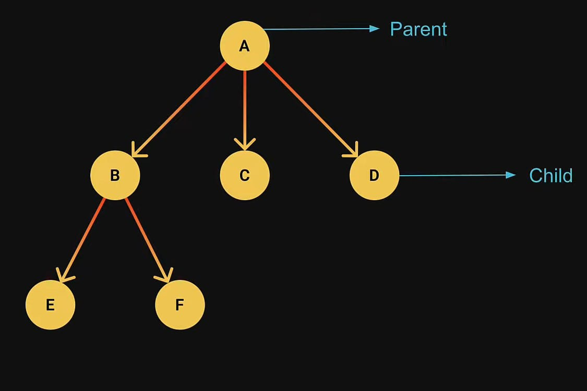
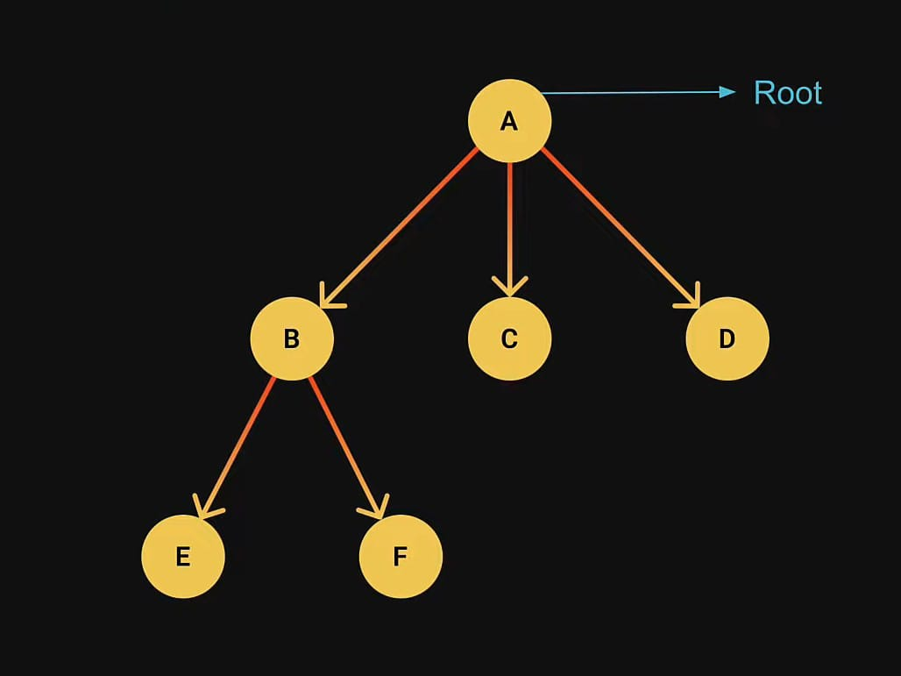
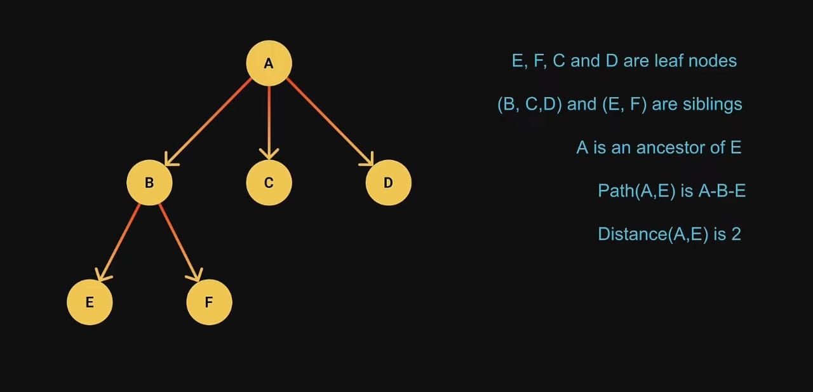
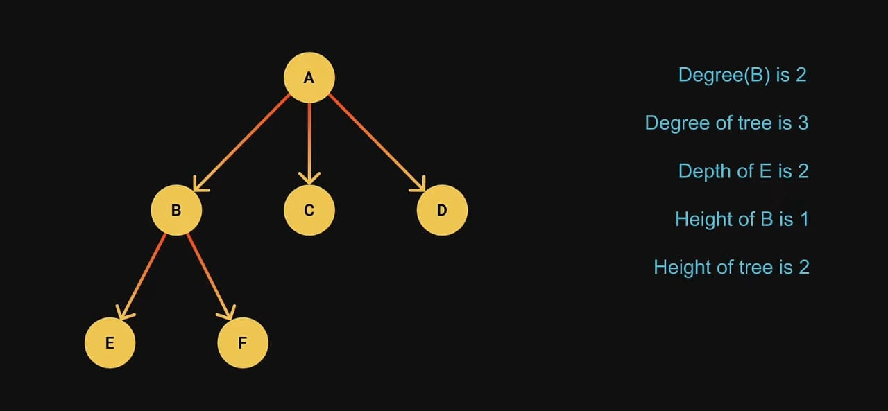

# Tree
- A tree is a hierarchical data structure that consists of nodes connected by edges.
- A tree is a non-linear data structure, compared to arrays, which are linear data structures.
- In linear data structures, the time required to search is propertional to the size of the data set.
- Trees however, owing to the nonlinear nature allow quicker and easier access to the data.
A tree will not contain any loops or cycles.

#### Visualization

#### Usage Example
- File systems  for directory structure
- A family tree
- An organization tree
- DOM
- Chat bots
- Abstract syntax trees

#### Terminology

