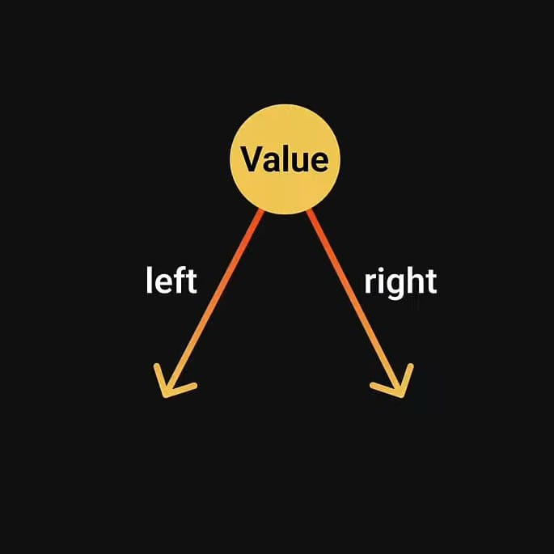
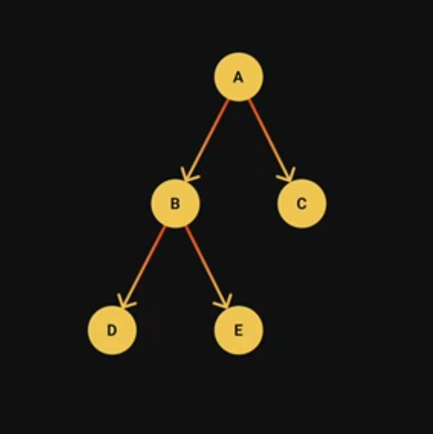
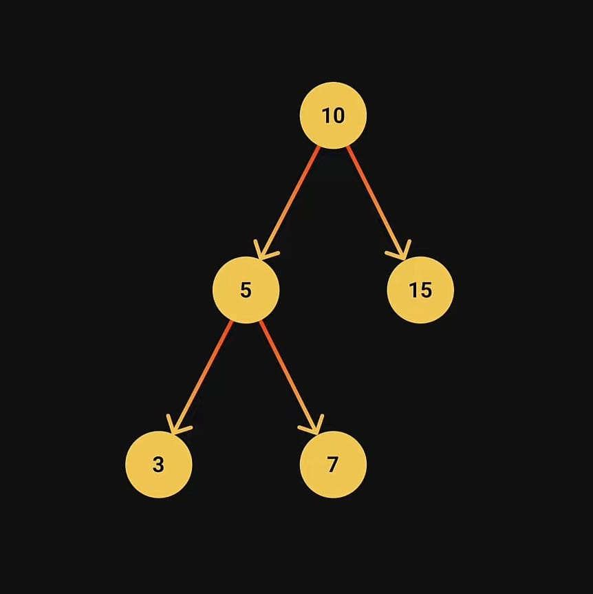

# Binary Search Tree



- The value of each left node must be smaller than the parent node
- The value of each right node must be greater than the parent node



#### Example



#### Operations - Methods

- `Insertion` - To add a node to the tree
- `Search` - To find a node given its value
- `DFS & BFS` - To visit all nodes in the tree
- `Deletion` - To remove a node given its value

#### Usage - Example

- Searching
- Sorting
- To Implement abstract data types such as lookup tables and priority queues

#### Code Example

- Node class

```javascript
class Node {
  constructor(value) {
    this.value = value;
    this.left = null;
    this.right = null;
  }
}
```

- Binary search tree methods class

```javascript
class BinarySearchTree {
  constructor() {
    this.root = null;
  }
  isEmpty() {
    return this.root === null;
  }
  insert(value) {
    const newNode = new Node(value);
    if (this.isEmpty()) {
      this.root = newNode;
    } else {
      this.insertNode(this.root, newNode);
    }
  }
  insertNode(root, newNode) {
    if (newNode.value < root.value) {
      if (root.left === null) {
        root.left = newNode;
      } else {
        this.insertNode(root.left, newNode);
      }
    } else {
      if (root.right === null) {
        root.right = newNode;
      } else {
        this.insertNode(root.right, newNode);
      }
    }
  }
  search(root, value) {
    if (!root) {
      return false;
    } else {
      if (root.value === value) {
        return true;
      } else if (value < root.value) {
        return this.search(root.left, value);
      } else {
        return this.search(root.right, value);
      }
    }
  }
  preOrder(root) {
    if (root) {
      console.log(root.value);
      this.preOrder(root.left);
      this.preOrder(root.right);
    }
  }
  inOrder(root) {
    if (root) {
      this.preOrder(root.left);
      console.log(root.value);
      this.preOrder(root.right);
    }
  }
  postOrder(root) {
    if (root) {
      this.preOrder(root.left);
      this.preOrder(root.right);
      console.log(root.value);
    }
  }
  levelOrder() {
    //use the optimized queue implementation
    const queue = [];
    queue.push(this.root);
    while (queue.length) {
      let curr = queue.shift();
      console.log(curr.value);
      if (curr.left) {
        queue.push(curr.left);
      }
      if (curr.right) {
        queue.push(curr.right);
      }
    }
  }
  min(root) {
    if (!root.left) {
      return root.value;
    } else {
      return this.min(root.left);
    }
  }
  max(root) {
    if (!root.right) {
      return root.value;
    } else {
      return this.max(root.right);
    }
  }
  remove(value) {
    this.root = this.removeNode(this.root, value);
  }
  removeNode(root, value) {
    if (root === null) {
      return root;
    }
    if (value < root.value) {
      root.left = this.removeNode(root.left, value);
    } else if (value > root.value) {
      root.right = this.removeNode(root.right, value);
    } else {
      if (!root.left && !root.right) {
        return null;
      }
      if (!root.left) {
        return root.right;
      } else if (!root.right) {
        return root.left;
      }
      root.value = this.min(root.right);
      root.right = this.removeNode(root.right, root.value);
    }
    return root;
  }
}
```

- use of Binary search tree methods

```javascript
const bst = new BinarySearchTree();
console.log(`Tree is empty? ${bst.isEmpty()}`); //Tree is empty? true

bst.insert(10);
bst.insert(5);
bst.insert(20);
bst.insert(35);
bst.insert(40);
bst.insert(3);
bst.insert(7);

console.log(bst.search(bst.root, 5)); //true
console.log(bst.search(bst.root, 25)); //false
console.log(bst.search(bst.root, 10)); //true

//DFS Algorithms
// bst.preOrder(bst.root);// 10 5 3 7 20 35 40
// bst.inOrder(bst.root)// 5 3 7 10 20 35 40
// bst.postOrder(bst.root)// 5 3 7 20 35 40 10

//BFS Algorithms
// bst.levelOrder(); // 10 5 20 3 7 35 40
/*
        10
        /\
       5  20
      /\   /\
     3 7  35 40
*/

console.log("min:", bst.min(bst.root)); //3
console.log("max:", bst.max(bst.root)); //40

// bst.remove(3)
// bst.levelOrder();// 10 5 20 7 35 40

bst.remove(5)
bst.levelOrder();// 10 7 20 3 35 40
```

#### Tree Transversal

- Visiting every node in the tree
- A hierarchical data structure like a tree can be transversed in different ways.
  1. Depth First Search (DFS)
  2. Breadth First Search (BFS)

<ins>Depth First Search (DFS)<ins>

- The DFS algorithms starts at the root node and explores as far as possible along each branch before backtracking
- Visit the root node, visit all the nodes in left subtree and visit all the node in right subtree.
- Depending on the order in which do this there can be three types of DFS traversals.
  1. Preorder
     - Read the data of the node
     - Visit the left subtree
     - Visit the right subtree
     ```javascript
     preOrder(root) {
         if (root) {
             console.log(root.value);
             this.preOrder(root.left);
             this.preOrder(root.right);
         }
     }
     ```
  2. Inorder
     - Visit the left subtree
     - Read the data of the node
     - Visit the right subtree
     ```javascript
     inOrder(root){
         if (root) {
             this.preOrder(root.left);
             console.log(root.value);
             this.preOrder(root.right);
         }
     }
     ```
  3. Postorder
     - Visit the left subtree
     - Visit the right subtree
     - Read the data of the node
     ```javascript
     postOrder(root) {
        if (root) {
            this.preOrder(root.left);
            this.preOrder(root.right);
            console.log(root.value);
        }
     }
     ```

<ins>Breadth First Search (BFS)</ins>

- Create a queue
- Enqueue the root node
- As long as a node exists in the queue
  1. Dequeue the node from the front
  2. Read the node's value
  3. Enqueue the node's left child if it exists
  4. Enqueue the node's right child if it exists
  ```javascript
  levelOrder(){
      //use the optimized queue implementation
      const queue = [];
      queue.push(this.root)
      while(queue.length){
          let curr = queue.shift();
          console.log(curr.value);
          if(curr.left){
              queue.push(curr.left)
          }
          if(curr.right){
              queue.push(curr.right)
          }
      }
  }
  ```


#### Time Complexity
- `isEmpty()` - O(1)
- `insert(value)` - O(n) (depend on height of tree)
- `search(root, value)` - O(n) (depend on height of tree)
- `DFS methods`
    1. `preOrder(root)` - O(n)
    2. `inOrder(root)` - O(n)
    3. `postOrder(root)` - O(n)
- `BFS methods`
    1. `levelOrder()` - O(n)
- `min(root)` - O(n) (depend on height of tree)
- `max(root)` - O(n) (depend on height of tree)
- `remove(value)` -  O(n) (depend on height of tree)