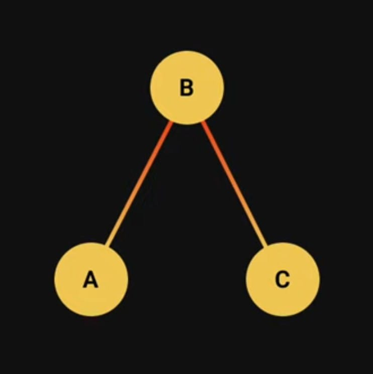
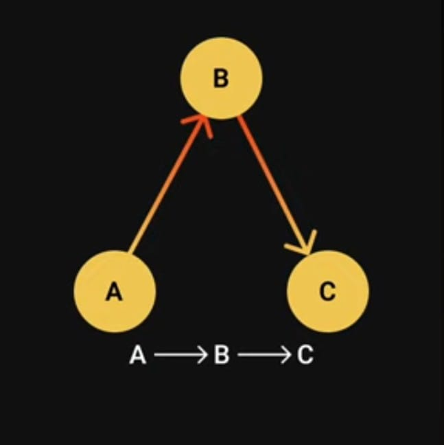
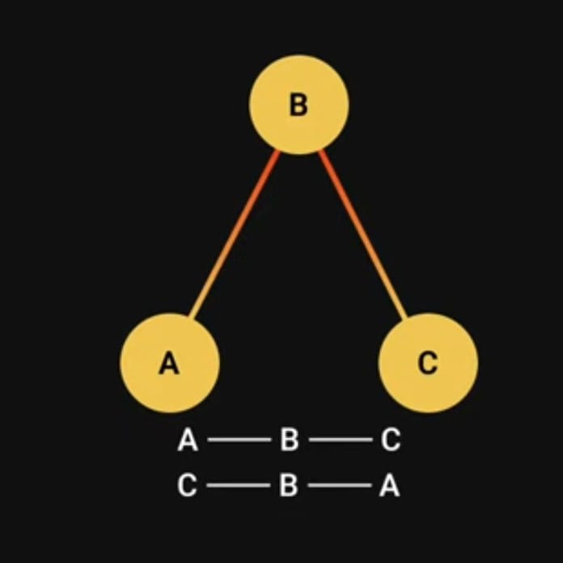
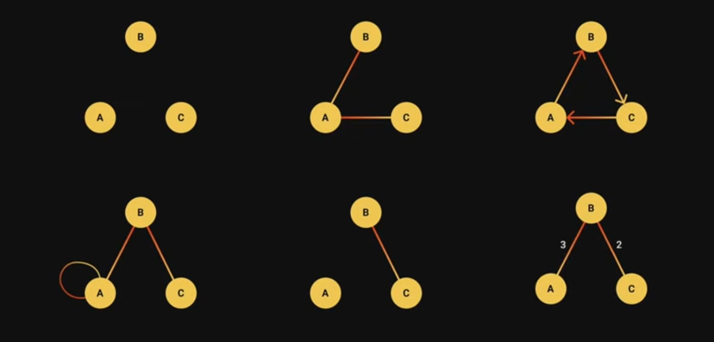
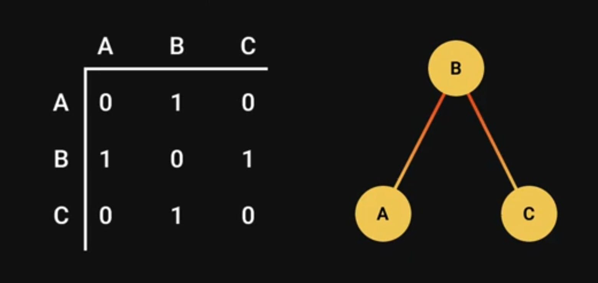
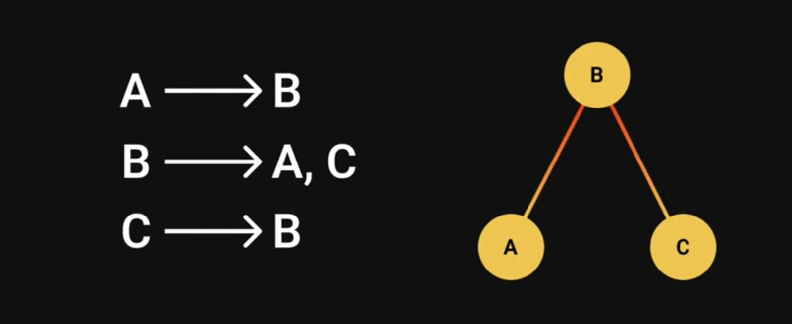

# Graph

- A graph is a non-linear data structure that consists of a finite number of vertices (also called nodes) connected by edges.
  

#### Types of Graph

1. Directed Graph
2. Undirected Graph

<ins>Directed Graph</ins>

- A graph is which the edges have a direction.
- Edges are usually represented by arrows pointing in the direction the graph can be traversed.
  

<ins>Undirected Graph</ins>

- A graph in which the edges are bidirectional.
- The graph can be traversed in either direction.
- The absence of an arrow tells us that the graph is undirected.


<ins>More Graph types</ins>


#### Usage - Example

- Google maps
- Social media sites

#### Representation

- <ins>Adjacency Matrix</ins>

  - An `adjacency matrix` is a `2D` array of size `V x V` where `V is the number of vertices in the graph`.
  - Each row and column represent a vertex.
  - If the value of any element say, matrix[i][j] is 1, it represents that there is an edge connecting vertex i and vertex j.
    
  - `code:`

  ```javascript
  const matrix = [
    [0, 1, 0],
    [1, 0, 1],
    [0, 1, 0],
  ];
  console.log(matrix[0][1]); //1
  ```

- <ins>Adjacency List</ins>
    
  - `code:`
  ```javascript
  const adjacencyList = {
    A: ["B"],
    B: ["A", "C"],
    C: ["B"],
  };
  console.log(adjacencyList["A"]); //[ 'B' ]
  console.log(adjacencyList["B"]); //[ 'A', 'C' ]
  console.log(adjacencyList["C"]); //[ 'B' ]
  ```

#### Adjacency Matrix vs Adjacency List
- `With an adjacency list`, we only need to store the values for the edges that exist. `With adjacency matrix`, you store values irrespective of whether an edge exists or not. Storage wise, an adjacency list is way more efficient.
- `With adjacency list`, inserting and finding adjacent nodes is constant time complexity whereas `with adjacency matrix`, it is linear time complexity.
- `An adjacency list` allows you to store additional values with an edge such as weight of the edge.
`With adjacency matrix`, such information would have to be stored externally.

#### Code - Example
- Methods made by self
```javascript
class Graph {
  constructor() {
    this.adjacencyList = {};
  }
  addVertex(vertex) {
    if (!this.adjacencyList[vertex]) {
      this.adjacencyList[vertex] = new Set();
    }
  }
  addEdge(vertex1, vertex2) {
    if (!this.adjacencyList[vertex1]) {
      this.addVertex(vertex1);
    }
    if (!this.adjacencyList[vertex2]) {
      this.addVertex(vertex2);
    }
    this.adjacencyList[vertex1].add(vertex2);
    this.adjacencyList[vertex2].add(vertex1);
  }
  removeEdge(vertex1, vertex2){
    this.adjacencyList[vertex1].delete(vertex2)
    this.adjacencyList[vertex2].delete(vertex1)
  }
  removeVertex(vertex){
    if(!this.adjacencyList[vertex]){
        return
    }
    for(let adjacencyVertex of this.adjacencyList[vertex]){
        this.removeEdge(vertex, adjacencyVertex)
    }
    delete this.adjacencyList[vertex]
  }
  hasEdge(vertex1, vertex2) {
    return (
      this.adjacencyList[vertex1].has(vertex2) &&
      this.adjacencyList[vertex2].has(vertex1)
    );
  }
  display() {
    for (let vertex in this.adjacencyList) {
      console.log(`${vertex} -> ${[...this.adjacencyList[vertex]]}`);
    }
  }
}
```
- Use of these methods
```javascript
const graph = new Graph();
graph.addVertex("A");
graph.addVertex("B");
graph.addVertex("C");

graph.addEdge("A", "B");
graph.addEdge("B", "C");

graph.display();
/*
A -> B
B -> A,C
C -> B
*/
console.log(graph.hasEdge("A", "B"));//true
console.log(graph.hasEdge("A", "C"));//false

// graph.removeEdge("A", "B")
// graph.display()
/*
A ->
B -> C
C -> B
*/

graph.removeVertex("B");
graph.display()
/*
A ->
C ->
*/
```

#### Time Complexity
- `addVertex()` - O(1)
- `addEdge()` - O(1)
- `removeVertex()` - O(1) (sometime O(n) according to node implementation)
- `removeEdge()` - O(1)
- `hasEdge()` - O(1)
- `display()` - O(n)